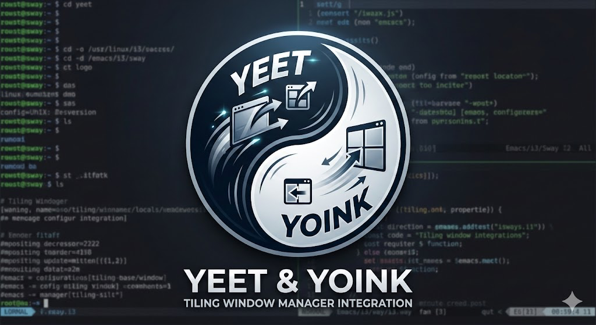

# yeetnyoink

<p align="center">
  
</p>


`yeetnyoink` routes `focus`, `move`, and `resize` through a geometry-first orchestrator with
domain plugins (WM / terminal / editor), plus a transfer pipeline for cross-domain moves.

## Config discovery

`config.toml` is loaded in this order:

1. `--config <path>` (explicit file path)
2. Platform config dir from `etcetera` (typically `$XDG_CONFIG_HOME/yeetnyoink/config.toml` on Linux)

If no file is present, defaults from `src/config.rs` are used; app integrations stay disabled
until their matching profiles set `enabled = true`.

Runtime-only overrides that used to live in environment variables now live in config too, for
example:

```toml
[runtime.logging]
debug = true

[runtime.vscode]
focus_settle_ms = 50

[runtime.zellij]
# Optional local override for the hosted zellij break plugin.
break_plugin = "/path/to/yeetnyoink-zellij-break.wasm"
```

Run `yny setup zellij` to print the hosted `load_plugins { ... }` release URL snippet.

## Minimal config example

```toml
[wm.niri] # or [wm.i3]/[wm.hyprland] on Linux, [wm.paneru]/[wm.yabai] on macOS
enabled = true

[app.terminal.wezterm]
enabled = true
mux_backend = "wezterm"
# Optional: let left/right edge focus step into adjacent WezTerm tabs.
host_tabs = "focus"
focus.internal_panes.enabled = true
move.internal_panes.enabled = true
resize.internal_panes.enabled = true
move.docking.tear_off.enabled = true

[app.editor.emacs]
enabled = true
focus.internal_panes.enabled = true
move.internal_panes.enabled = true
resize.internal_panes.enabled = true
move.docking.tear_off.enabled = true

[app.editor.neovim]
enabled = true
[app.editor.neovim.ui.terminal]
app = "wezterm"
mux_backend = "inherit"

[app.browser.librewolf]
enabled = true
# Optional: route north/south to previous/next tab instead of west/east.
# Use `vertical_flipped` if your browser feels inverted with `vertical`.
tab_axis = "vertical"
```

If you choose `wm.macos_native`, set `wm.macos_native.enabled = true`, choose a required
`wm.macos_native.floating_focus_strategy` (`radial_center`, `trailing_edge_parallel`,
`leading_edge_parallel`, `cross_edge_gap`, `overlap_then_gap`, or `ray_angle`), and configure
both `wm.macos_native.mission_control_keyboard_shortcuts.move_left_a_space` and
`.move_right_a_space` with `keycode = "0x..."` plus `shift`/`ctrl`/`option`/`command`/`fn`
booleans. Other WM backends may omit `floating_focus_strategy` entirely or set it optionally to
use one of the same named strategies for floating-window directional focus.

Terminal-hosted editors use `app.editor.<editor>.ui.terminal` to describe which terminal UI they
run inside and which mux backend to use there. Direct graphical editors can additionally describe
their GUI surface under `app.editor.<editor>.ui.graphical`.

Foot, Alacritty, and Ghostty are also supported as external terminal hosts;
configure them under `[app.terminal.foot]`, `[app.terminal.alacritty]`, or
`[app.terminal.ghostty]` with `mux_backend = "tmux"` or `mux_backend = "zellij"`.
For kitty native mux (`mux_backend = "kitty"`), kitty itself must expose remote
control to detached callers; add this to `~/.config/kitty/kitty.conf` and restart kitty:

```conf
allow_remote_control socket-only
listen_on unix:@kitty-{kitty_pid}
```

`host_tabs` controls whether terminal host tabs participate in directional routing.
Use `transparent` to keep current behavior, `focus` to let edge focus traverse adjacent
host tabs on `left`/`right`, and `native_full` to additionally move panes across host tabs
for native WezTerm/kitty mux backends.

## Home Manager module

The flake exports `homeManagerModules.default`. Its
`programs.yeetnyoink.config.*` options are typed to match `src/config.rs`,
and Home Manager renders them to `~/.config/yeetnyoink/config.toml`.

```nix
{
  imports = [ inputs.yeetnyoink.homeManagerModules.default ];

  programs.yeetnyoink = {
    enable = true;
    config = {
      wm.niri.enabled = true;

      app.terminal.wezterm = {
        enabled = true;
        mux_backend = "wezterm";
        host_tabs = "focus";
        focus.internal_panes.enabled = true;
        move.internal_panes.enabled = true;
        resize.internal_panes.enabled = true;
        move.docking.tear_off.enabled = true;
      };

      app.editor.neovim = {
        enabled = true;
        ui.terminal = {
          app = "wezterm";
          mux_backend = "inherit";
        };
      };
    };
  };
}
```

If you need to bypass the typed options, set `programs.yeetnyoink.config.raw`
to raw TOML instead.

## Plugin packages

Integration assets live under `plugins/`:

- `plugins/firefox`: Firefox-family WebExtension source as a git submodule
- `plugins/chrome`: Chromium-family unpacked extension source as a git submodule
- `plugins/zellij-bridge`: source for the release-published zellij break plugin

Clone with submodules enabled:

```sh
git clone --recurse-submodules https://github.com/smallstepman/yeetnyoink.git
```

Or initialize them after cloning:

```sh
git submodule update --init --recursive
```

## Runtime architecture

- Command entrypoints: `src/commands/{focus,move_win,resize}.rs`
- Orchestration core: `src/orchestrator.rs`
- Geometry solver: `src/topology.rs`
- Domain/plugin contracts: `src/domain.rs`
- Runtime domain plugins + native-id bridge: `src/domain_plugins.rs`
- Transfer negotiation/conversion: `src/transfer.rs`, `src/pane_state.rs`

## Window manager adapters

Current built-in WM adapters:

- `niri`
- `i3`
- `hyprland`
- `macos_native`
- `paneru`
- `yabai`

Adapter selection is driven by the single `wm.<backend>` table whose `enabled` field is `true`. No runtime probing occurs; selection is explicit and must be set in your config or via the CLI.
